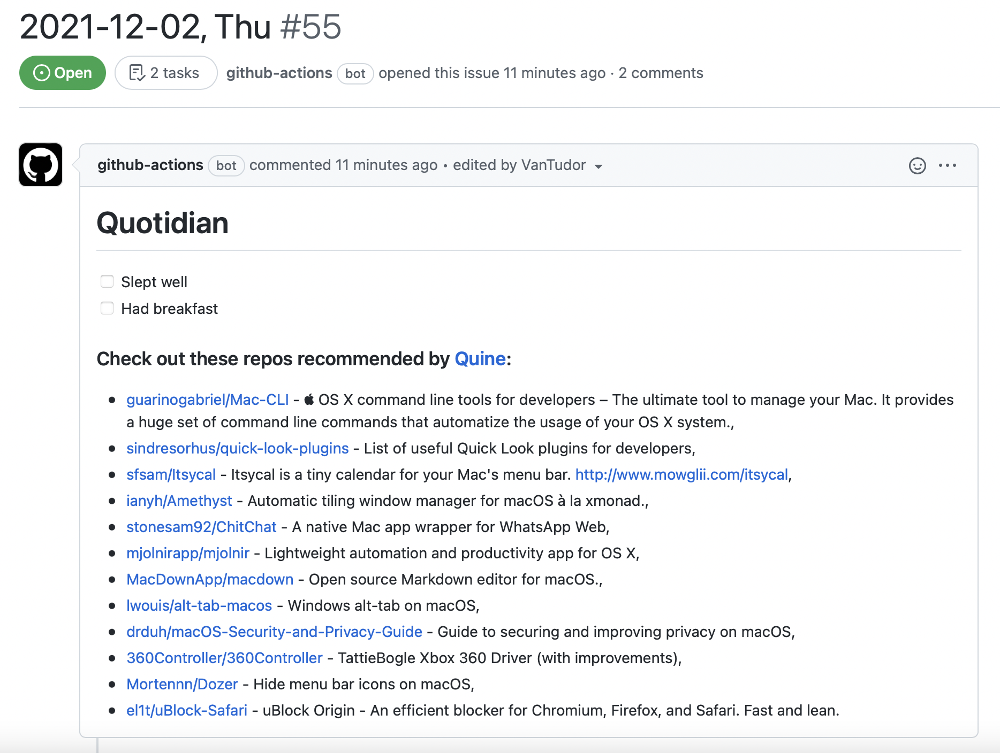
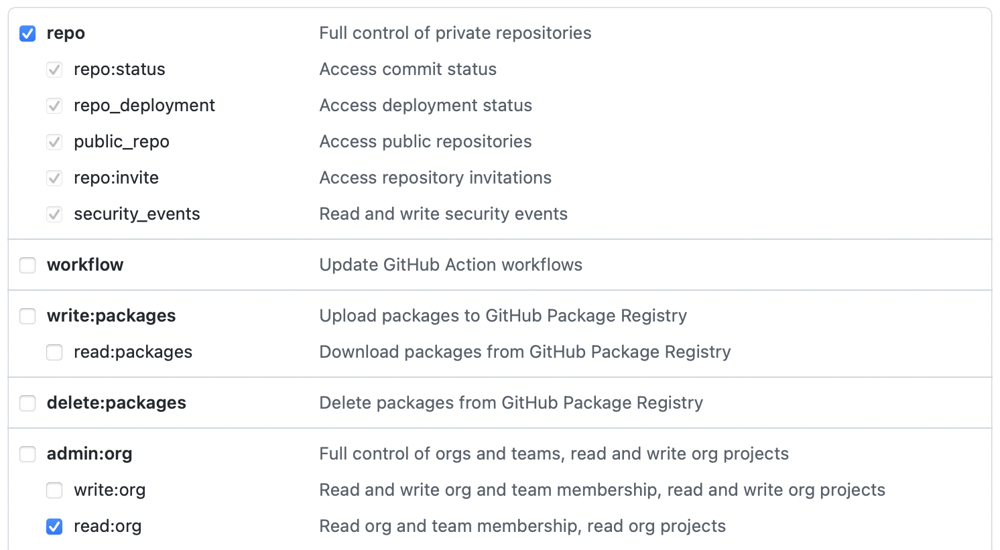
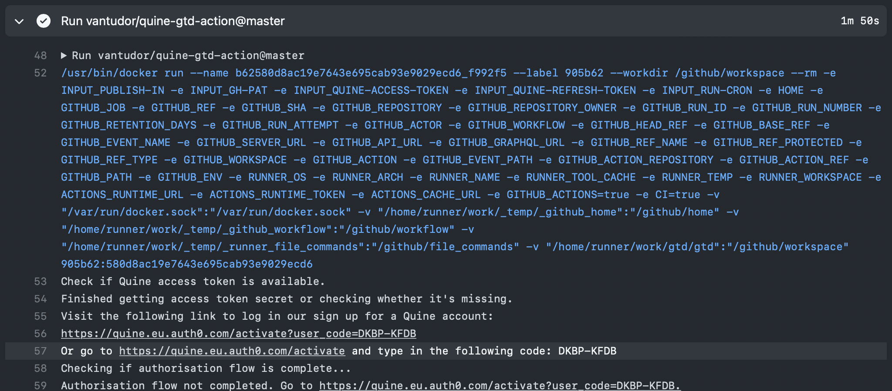
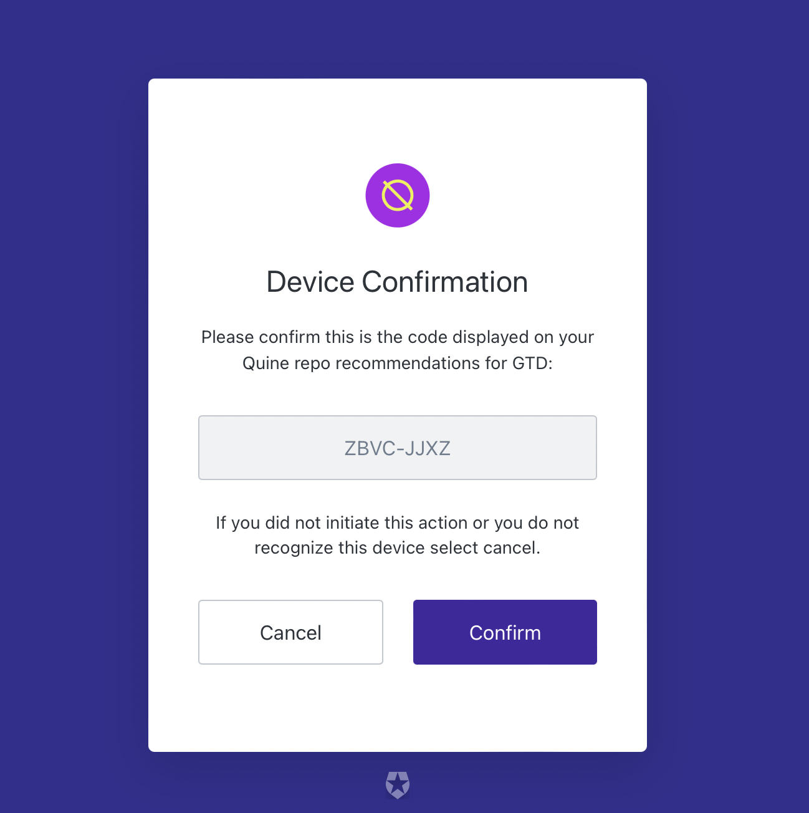
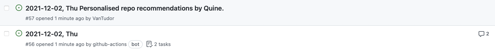
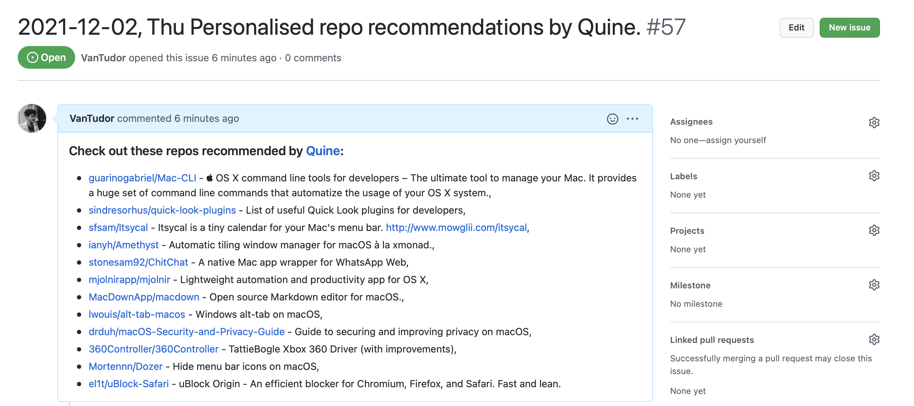

# Scout for “Git Things Done”

Daily repo recs for your [GitTD](https://github.com/git-things-done).

* Powered by Quine’s *advanced* AI recommendation engine
* *Personal* suggestions tailored to *your development style*
* Daily, weekly, monthly, etc.; *you choose*




# Getting Started

In your `.github/workflows/porter.yml`:

```yaml
jobs:
  porter:
    steps:
      # [snip…]

      - uses: quine-sh/repo-recommendations-for-gtd@main
        with:
          gh-pat: ${{ secrets.QUINE_GITHUB_TOKEN }}

          # ⬇️⬇️ don’t touch! the action manages these *for you* ⬇️⬇️
          quine-access-token: ${{ secrets.QUINE_ACCESS_TOKEN}}
          quine-refresh-token: ${{ secrets.QUINE_REFRESH_TOKEN}}
```

See [@git-things-done](https://github.com/git-things-done) for further
documentation.

## Setting `gh-pat`

The Quine API requires a GitHub “personal access token”†:

1. Visit https://github.com/settings/tokens
2. Generate a new token called `QUINE_GITHUB_TOKEN`
3. We require `repo:all` and `org:read`
    
4. Add as a secret called `QUINE_GITHUB_TOKEN` in your GitTD fork‡

> † So we can manage the `QUINE_*_TOKEN` secrets for you.\
> ‡ https://github.com/${{ you }}/gtd/settings/secrets/actions

## 🚨 The First Run 🚨

The first time the workflow runs you'll need to sign in to your Quine account.
When it runs you’ll see a link:



<details>
<summary>Click the link. From now on your recommendations will run.</summary>



</details>


# Configuration

## Publish Location

You can configure the action to either:

* `publish-in: porter-issue`: ie. in the body of *today’s ticket* (the default)
* `publish-in: separate-issue`: we create a new *separate* ticket




## Periodicity

By default we run everyday†. Probably, this is overkill so you can change this
with the `run-cron` parameter:

```yaml
- uses: quine-sh/repo-recommendations-for-gtd@main
  with:
    run-cron: * * * * 1
```

The above runs *every Monday*. For syntax assistance see https://crontab.guru.

> † We do this so you can be sure it is working rather than having to wait a week…

<details>
<summary>
Caveats
</summary>

- The action only takes the month, week and day parameters into account, because
  this time pattern is dependent on the parent workflow cron.
- We assume this value to be a subset of the parent workflow's cron. ie. if
  the workflow’s cron instructs GitHub to run the cron on every Tuesday, but
  this action is set to run on a daily basis, **the action will only run on
  Tuesdays**.

</details>


# Setting Up As A Separate Workflow

In your GitTD, create a file called `.github/workflows/quine.yml` containing:

```yaml
name: Quine Repo Recs
on:
  workflow_dispatch:
  schedule:
    - cron: '0 6 * * 1'
jobs:
  quine-repo-recs:
    runs-on: ubuntu-latest
    steps:
      - uses: actions/checkout@v2
        with:
          fetch-depth: 0  #FIXME https://github.com/git-things-done/gtd/discussions/10
      - uses: quine-sh/repo-recommendations-for-gtd@main
        with:
          publish-in: "separate-issue"
          gh-pat: ${{ secrets.QUINE_GITHUB_TOKEN }}
          quine-access-token: ${{ secrets.QUINE_ACCESS_TOKEN}}
          quine-refresh-token: ${{ secrets.QUINE_REFRESH_TOKEN}}
```
